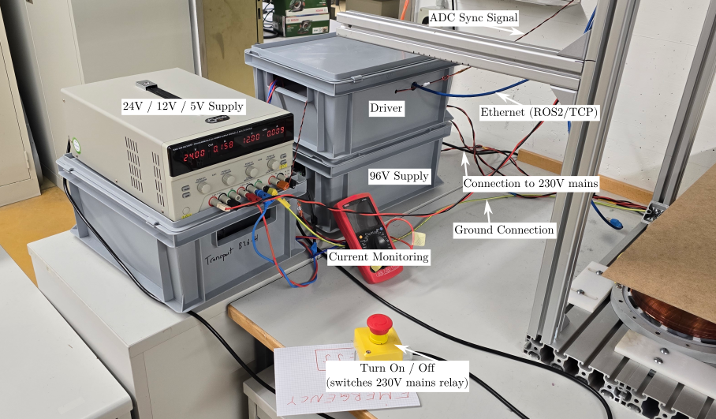
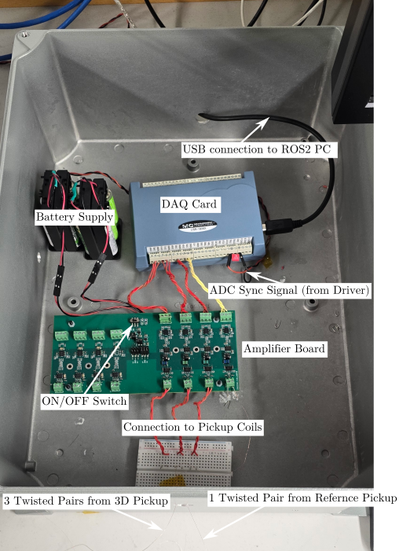

# EM Tracking Project

This repository contains the code for the `em_tracking` project. Related repositories:

- [Repo for three axis stage](https://github.com/ethz-msrl/stages_utils)
- [MDriver ROS2 Repo](git@github.com:ethz-msrl/mdriver_ros2.git)

## Setup Overview
### Turn on procedure:
1. Turn on the 24V/12V/5V Supply
2. Turn on the Multimeter and then turn on the 96V supply by rotating the red button. You should hear the fans of the 96V supply. After initially drawing some current, the setup should draw around 0.2A.
3. Run `ros2 launch em_tracking signal_test.xml` to test the the driver and data acquisition.
4. Run `ros2 launch em_tracking localization.xml` to test the localization.

**Emergency Turn-Off** : In case of unexpected system behaviour or excessive power/current draw (as indicated by the Multimeter current measurement), the power to the 96V supply can be cut by pushing the red button.

**Shock Hazard** : 
- The 96V supply and the On/Off button are connected to the 230V mains supply. Ensure that the connection to the 230V line is disconnected and wait for at least 5min before making any adjustments to the button or 96V supply.
- **Always turn off the 96V supply and disconnect the 230V mains connection when performing any work or adjustments on the system.**

### Power Supplies

- 24V/12V/5V supply : Supplies power to the stepper motor stage (24V), and the power electronic driver (12V/5V). 
- 96V supply: Supplies power to the power electronic driver. Turn on by rotating red button, turn off by pushing red button.
- Current monitoring: Can be used to measure the current (and power) flowing into the system. Useful for debugging purposes.
- Ethernet (ROS2/TCP) : Cable for TCP connection to the `mdriver` node.
- ADC Sync Signal : Twisted pair cable that is connected to the DAQ card. (Used for synchronizing DAQ card and power electronic driver)
### DAQ Setup
 
 - Amplifier Board: Amplifies the four signals (three signals from 3D pickup coil and one signal from reference pickup coil). Turn on/off using the rocker switch. **Don't forget to turn off** to avoid draining batteries. Note: Only the right-hand side of the PCB (as shown in the figure) is used. The other side is not used (jumper not connected).
 - DAQ Card : Samples amplified signals and sends data via USB to ROS2 PC. The data is read by the `pickup_node`.
 - Battery supply : Supplies power to the amplifier board.
 - ADC Sunc Signal : Originates from power electronic driver. This signal is used to synchronize the data acquisition card and the driver. A capacitor is connected at the input of the DAQ card as well to suppress noise (capacitor is is needed).
 ## Stepper Stage
- The Arduino board of the stepper stage is connected to the ROS2 PC using a USB cable.
- The code for the stepper stage is located [in this repo](https://github.com/ethz-msrl/stages_utils)
- To use the stepper stage, enable the 24V output to the stage using the 24V/12V/5V supply. Run the `three_axis_stage.py` script and drive the stage using the `WASDRF` keyboard keys. The script also illustrates how to interface with the stage via Python.

## Launch Files

| Launch File Name  | Description |
| ------------- |:-------------:|
| `signal_test.xml`     | This launch file runs the `mdriver_node` and the `pickup_node` and acquires a set of test measurements |
|`localization.xml`| This launch file runs the `mdriver_node` (communication with driver), the `pickup_node` (communication with DAQ card), the `localization_node` (localizing the pickup coils) as well as RViz for visualization.|

## Nodes

### Pickup Node

This node is used to continuously read from the `USB-1808GX` DAQ card. Use with `ros2 launch em_tracking pickup.xml`.

| Parameter Name  | Right columns |
| ------------- |:-------------:|
| sample_rate     | DAQ sample rate in Hz (default: 200kHz) |
| samples_per_channel      | samples per DAQ channel (default: 2000) |

### Measurement Node

This node is used to take `N` voltage frame measurements for postprocessing.
```bash
ros2 run em_tracking measurement_node.py --ros-args -p no_measurements:=64
```

## Environment Variables

- `LOCALDATABASEDIR` : Local database directory, default storage location for measurements 